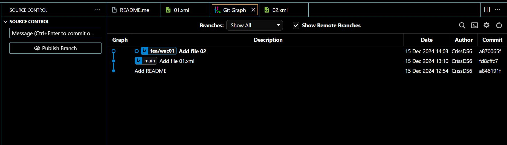

    1. Crear repositorio local y subir a GITHUB
1. Crea una carpeta llamada UT2.1.a.

2. Inicializa un repositorio local en la carpeta UT2.1.

3. Revisa qué rama se ha creado por defecto. ¿Desde dónde los visualizas? adjunta la imagen
La rama por defecto es "Main"(aparece indicado abajo del todo a la izquierda de la imagen)

3. Renombrar la rama por defecto a main en caso de que tenga otro nombre. adjunta un gif.   
   La rama por defecto se llama main, por lo que este paso no lo tengo que realizar :smiley::tada::tada::tada:

4. Agrega un fichero README.md.

# UT2.1.a

Repositorio de prueba para la tarea 2.1.a

6. Agrega el fichero README.md al stage area. (realizo pasos 6 y  7 juntos, adjunto gift en punto 7 :wink: )

7. Realiza un commit con el mensaje "Add README". 

8. Agrega otro fichero 01.xml con siguiente texto.

<?xml version="1.0" encoding="UTF-8"?>
<libreria>
    <libro>
        <titulo>El Quijote</titulo>
        <autor>Miguel de Cervantes</autor>
        <editorial>Editorial Castalia</editorial>
        <fecha>1605</fecha>
        <genero>Novela</genero>
        <precio>20</precio>
    </libro>
</libreria>
9.Agrega el fichero 01.xml al stage area y realiza el commit "Add file 01.xml" 

10.  Agrega una nueva rama llamada fea/wac01 con la ayuda git-graph. 

11.  En qué rama estas ahora mismo? ¿Cómo sabes en qué rama estás? adjunta la imagen y explica en breves palabras.

En la siguiente imagen, se puede ver que estoy en la rama main. Es la que aparece por delante y está resaltada.

Rama actual

12. Estando en la rama fea/wac01 agrega un fichero 02.xml, y agrega al área de stage y realiza commit "Add file 02". adjunta un gif

<?xml version="1.0" encoding="UTF-8"?>
<libreria>
    <libro>
        <titulo>El Hobbit</titulo>
        <autor>J.R.R. Tolkien</autor>
        <editorial>Minotauro</editorial>
        <fecha>1937</fecha>
        <genero>Fantasía</genero>
        <precio>15</precio>
    </libro>
</libreria>

Aquí va el gift de este paso: 

13. Muestra el log (pantalla de git-graph donde se visualize el commit). adjunta la imagen

14. Posicionate de nuevo en la rama main, y crea otra rama fea/wac02, posicionandote directamente en ella. Agrega un fichero 03.xml, agrega al área de stage y realiza commit "Add file 03".

<?xml version="1.0" encoding="UTF-8"?>
<libreria>
    <libro>
        <titulo>El Señor de los Anillos</titulo>
        <autor>J.R.R. Tolkien</autor>
        <editorial>Minotauro</editorial>
        <fecha>1954</fecha>
        <genero>Fantasía</genero>
        <precio>25</precio>
    </libro>
</libreria>
15. Posicionate en la rama main y muestra los ficheros que hay en el directorio. (mostrar el arból de directorios de VS Code). adjunta la imagen

16. Realizar un merge de la rama fea/wac01 en la rama main. adjunta un gif

17. Muestra el el log, y los ficheros que hay en el directorio. (mostrar el arból de directorios de VS Code) adjunta la imagen  
Carpetas que pueden verse en main:
 
Carpetas que pueden verse en fea/wac02

18.  Elimina la rama fea/wac01 sin posibilidad de recuperación. adjunta un gif

19.  Realiza un merge de la rama fea/wac02 en la rama main. adjunta un gif

20. Muestra el log, y los ficheros que hay en el directorio. (Imagen) adjunta la imagen 

21. Vuelve a la rama fea/wac02 y modifica el fichero 03.xml añadiendo un nuevo libro.

<?xml version="1.0" encoding="UTF-8"?>
<libreria>
    <libro>
        <titulo>El Señor de los Anillos</titulo>
        <autor>J.R.R. Tolkien</autor>
        <editorial>Minotauro</editorial>
        <fecha>1954</fecha>
        <genero>Fantasía</genero>
        <precio>25</precio>
    </libro>
    <libro>
        <titulo>El Silmarillion</titulo>
        <autor>J.R.R. Tolkien</autor>
        <editorial>Minotauro</editorial>
        <fecha>1977</fecha>
        <genero>Fantasía</genero>
        <precio>25</precio>
    </libro>
</libreria>
Agrega al área de stage y realiza commit "Update 03 file. Add book El Silmarillion".
adjunta un gif, donde se visualize el contenido del fichero y el commit

He realizado este paso y no me he dado cuenta de darle a grabar, por lo que te adjunto una imagen en la que se ve que he actualizado el archivo y que hice el commit :sweat_smile::pray:

22. Realiza un merge de la rama fea/wac02 en la rama main. adjunta un gif

23. Muestra el log del repositorio, y muestra el contenido del fichero 03.xml. (Imagen visualizando comandos) adjunta gif 

24. Ahora, en la rama main modifica el fichero 03.xml incluyendo un nuevo libro.

<?xml version="1.0" encoding="UTF-8"?>
<libreria>
    <libro>
        <titulo>El Señor de los Anillos</titulo>
        <autor>J.R.R. Tolkien</autor>
        <editorial>Minotauro</editorial>
        <fecha>1954</fecha>
        <genero>Fantasía</genero>
        <precio>25</precio>
    </libro>
    <libro>
        <titulo>El Silmarillion</titulo>
        <autor>J.R.R. Tolkien</autor>
        <editorial>Minotauro</editorial>
        <fecha>1977</fecha>
        <genero>Fantasía</genero>
        <precio>25</precio>
    </libro>
    <libro>
        <titulo>El Hobbit</titulo>
        <autor>J.R.R. Tolkien</autor>
        <editorial>Minotauro</editorial>
        <fecha>1937</fecha>
        <genero>Fantasía</genero>
        <precio>15</precio>
    </libro>
</libreria>
Agrega al área de stage y realiza commit "Update 03 file. Add book El Hobbit".
adjunta un gif, donde se visualize el contenido del fichero y el commit

25. Agrega un nuevo fichero 04.xml sobre libros ciencia-ficcion, en la rama main.

<?xml version="1.0" encoding="UTF-8"?>
<libreria>
    <libro>
        <titulo>El fin de la eternidad</titulo>
        <autor>Isaac Asimov</autor>
        <editorial>Edhasa</editorial>
        <fecha>1955</fecha>
        <genero>Ciencia ficción</genero>
        <precio>20</precio>
    </libro>
</liberia>
Agrega al área de stage y realiza commit "Add 04 file. Add cienca-ficcion books".

26. Muestra el registro de commits (log) y los ficheros que hay en el directorio. adjunta una imagen

27. Vuelve un commit atrás, y muestra el log y los ficheros que hay en el directorio. adjunta un gif

28. Vuelve al commit anterior, y muestra el log y los ficheros que hay en el directorio. adjunta un gif

29. Posicionate de nuevo en el último commit, y muestra el log y los ficheros que hay en el directorio. adjunta un gif 

    2. Crear repositorio remoto y subir a GITHUB  
   
2.1 Crea un repositorio remoto en GITHUB llamado EEDD_{NombreApellido}_TE2.1 público, vacio, sin nada.

2.2 Agrega el repositorio remoto a tu repositorio local. Explica cómo lo haces, y adjunta una imagen donde se visualizen las url's
Repositorio remoto

 a) En primer lugar, añado un archivo .md para que se me active el botón verde CODE y así poder copiar la URL.
 b)Después desde VScode, abro el terminal y mediante los comandos: git remote -v origin + (URL REPOSITORIO REMOTO) vinculo ambos repositorios. 

 
1. Sube la rama main al repositorio remoto. adjunta un gif

1. Posicionate en la rama fea/wac02 y sube la rama fea/wac02 al repositorio remoto. adjunta un gif

5. Ahora desde GITHUB (web) en la rama fea\wac02, modifica el fichero 03.xml añadiendo un nuevo libro.

<?xml version="1.0" encoding="UTF-8"?>
<libreria>
    <libro>
        <titulo>El Señor de los Anillos</titulo>
        <autor>J.R.R. Tolkien</autor>
        <editorial>Minotauro</editorial>
        <fecha>1954</fecha>
        <genero>Fantasía</genero>
        <precio>25</precio>
    </libro>
    <libro>
        <titulo>El Silmarillion</titulo>
        <autor>J.R.R. Tolkien</autor>
        <editorial>Minotauro</editorial>
        <fecha>1977</fecha>
        <genero>Fantasía</genero>
        <precio>25</precio>
    </libro>
    <libro>
        <titulo>El Hobbit</titulo>
        <autor>J.R.R. Tolkien</autor>
        <editorial>Minotauro</editorial>
        <fecha>1937</fecha>
        <genero>Fantasía</genero>
        <precio>15</precio>
    </libro>
    <libro>
        <titulo>El hombre bicentenario</titulo>
        <autor>Isaac Asimov</autor>
        <editorial>Edhasa</editorial>
        <fecha>1976</fecha>
        <genero>Ciencia ficción</genero>
        <precio>20</precio>
</libreria>
Realiza un commit con el mensaje "Update 03 file. Add book El hombre bicentenario". (Muestra pantallazo de GITHUB con el commit realizado) adjunta la imagen

6. Ahora obten los cambios sin acualizar el repositorio local (git fetch origin).
Muestra el log del repositorio local adjunta la imagen

7. Ahora actualiza el repositorio local con los cambios del repositorio remoto (git pull) y muestra el log. adjunta un gif  
   Adjunto imagen ya que he vuelto a olvidar grabar el gift :scream:

1. Haz un merge de la rama fea/wac02 en la rama main. Muestra estado, log, y el contenido fichero 03.xml (Incluye imagen) adjunta un gif

9. Sube la rama main al repositorio remoto. adjunta una gif

10. Elimina la rama local fea/wac02 sin posibilidad de recuperación. adjunta un gif
    

11. Elimina la rama remota fea/wac02 sin posibilidad de recuperación

12. Muestra desde GITHUB (navegador web) las ramas que tienes el en repositorio remoto. adjunta un gif

13. Para finalizar, muestra el log del repositorio local (Incluye imagen) adjunta la imagen

    3. Enlace repositorio remoto
Incluye el enlace al repositorio remoto en este punto para que el profesor pueda acceder a él.
 // Enlace al repositorio remoto (en que aparece en la URL del navegador)
 
 https://github.com/CrissDS6/EEDD_CRISTINADELGADO_TE2.1.git

 FIN!!:tada::confetti_ball::fireworks::dancer::smiley:
 
